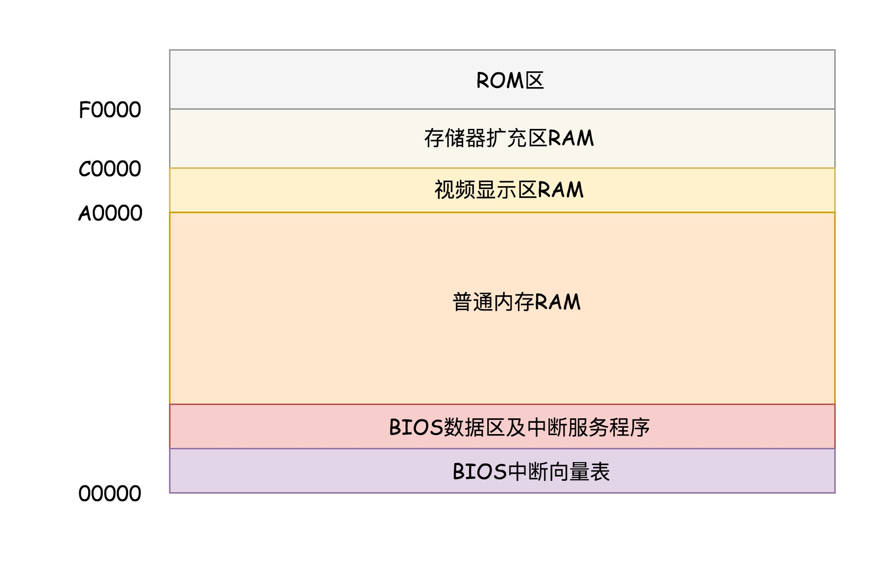

# 07-从BIOS到bootloader：创业伊始，有活儿老板自己上-学习总结

x86 有两种模式，其中实模式只能寻址 1M，每个段最多 64k，保护模式在 32 位系统下能寻址 4G。

## BIOS 时期

### BIOS

主板上的 ROM（Read Only Memory，只读存储器）固化了一些初始化的程序，也就是BIOS（Basic Input and Output System，基本输入输出系统）。

### 计算机启动到运行 BIOS 的过程

1. 当按下计算机的启动按钮时，主板加电，这时 CPU 处于实模式，只能寻址 1M 的内存空间。在 x86 系统中，将 1M 空间最上面的 0xF0000 到 0xFFFFF 这 64K 映射给 ROM，也就是说，到这部分地址访问的时候，会访问 ROM。
2. 计算机会做一些重置工作，将 CS 设置为 0xFFFF，将 IP 设置为 0x0000，所以第一条指令就会指向 0xFFFF0，正是在 ROM 的范围内。在这里，有一个 JMP 命令会跳到 ROM 中做初始化工作的代码，于是，BIOS 开始进行初始化的工作：
   - 检查系统硬件；
   - 提供基本输入服务，即建立中断向量表和中断服务程序，让键盘鼠标能够工作；
   - 提供基本输出服务，即在内存空间映射显存的空间，在显示器上输出内容。

## bootloader 时期

### MBR 中的启动程序

作为启动盘的硬盘，一般在第一个扇区有段启动程序代码，占 512 字节，而且以 0xAA55 结束，这是一个约定。

在 Linux 中的 **Grub2**（Grand Unified Bootloader Version 2），是个搞系统启动的工具，使用`grub2-install /dev/sda`可以将启动程序安装到启动盘相应的位置。grub2 第一个要安装的就是 boot.img。它由 boot.S 编译而成，一共 512 字节，安装到启动盘的第一个扇区。这个扇区通常称为**MBR**（Master Boot Record，主引导记录 / 扇区）。

可以通过`grub2-mkconfig -o /boot/grub2/grub.cfg`来配置系统启动的选项。

### BIOS 运行启动程序

BIOS 完成任务后，会将 boot.img 从硬盘加载到内存中的 0x7c00 来运行，大概过程如下：

1. boot.img 加载 grub2 的另一个镜像 core.img，core.img 由 lzma_decompress.img、diskboot.img、kernel.img 和一系列的模块组成。boot.img 先加载的是 core.img 的第一个扇区。如果从硬盘启动的话，这个扇区里面是 diskboot.img，对应的代码是 diskboot.S。
2. diskboot.img 先是解压缩程序 lzma_decompress.img，再往下是 kernel.img，最后是各个模块 module 对应的映像。lzma_decompress.img 对应的代码是 startup_raw.S。
3. 在真正的解压缩之前，lzma_decompress.img 做了一个重要的决定，就是调用 real_to_prot，切换到保护模式，这样就能在更大的寻址空间里面，加载更多的东西。

## 从实模式切换到保护模式

1. 启用分段，在内存中建立段描述符表，将寄存器里面的段寄存器变成段选择子，指向某个段描述符，这样就能实现不同进程的切换了。
2. 启动分页，能够管理的内存变大了，就需要将内存分成相等大小的块。
3. 切换保护模式的函数 DATA32 call real_to_prot 会打开 Gate A20，也就是第 21 根地址线的控制线。在实模式 8086 下面，一共就 20 个地址线，可访问 1M 的地址空间。如果超过了这个限度怎么办呢？当然是绕回来了。在保护模式下，第 21 根要起作用了，于是我们就需要打开 Gate A20。
4. 对压缩过的 kernel.img 进行解压缩，然后跳转到 kernel.img 开始运行。kernel.img 对应的代码是 startup.S 以及一堆 c 文件，在 startup.S 中会调用 grub_main，这是 grub kernel 的主函数。在这个函数里面，grub_load_config() 开始解析 grub.conf 文件里的配置信息。
5. 如果是正常启动，grub_main 最后会调用 grub_command_execute (“normal”, 0, 0)，最终会调用 grub_normal_execute() 函数。在这个函数里面，grub_show_menu() 会显示出让你选择的那个操作系统的列表
6. 选择启动某个操作系统，就要开始调用 grub_menu_execute_entry() ，开始解析并执行选择的那一项。例如里面的 linux16 命令，表示装载指定的内核文件，并传递内核启动参数。于是 grub_cmd_linux() 函数会被调用，它会首先读取 Linux 内核镜像头部的一些数据结构，放到内存中的数据结构来，进行检查。如果检查通过，则会读取整个 Linux 内核镜像到内存。
7. 如果配置文件里面还有 initrd 命令，用于为即将启动的内核传递 init ramdisk 路径。于是 grub_cmd_initrd() 函数会被调用，将 initramfs 加载到内存中来。
8. grub_command_execute (“boot”, 0, 0) 开始真正地启动内核。

## 总结

