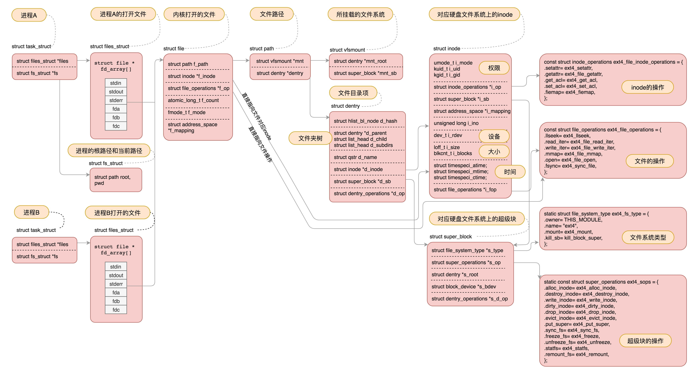
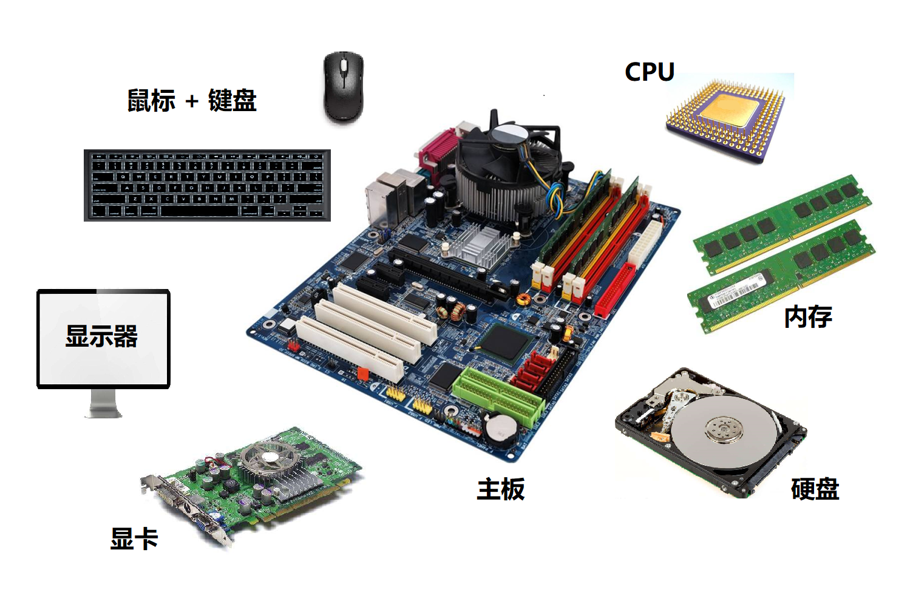
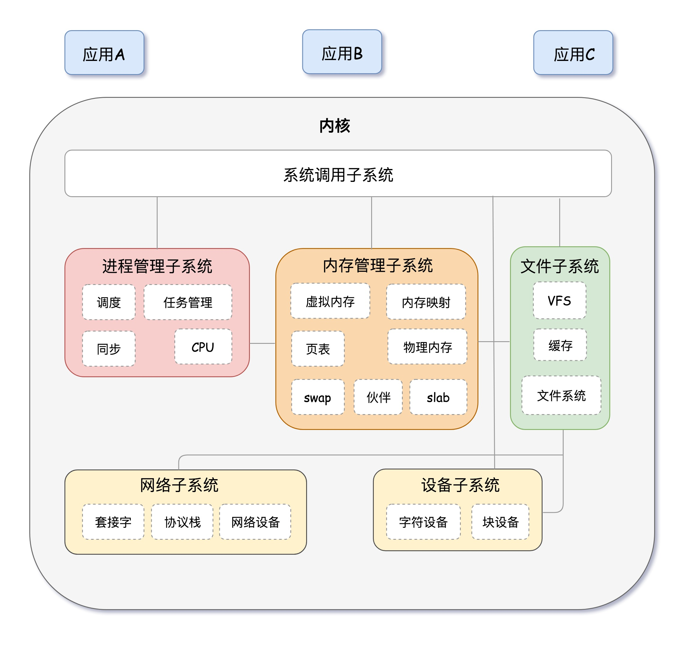
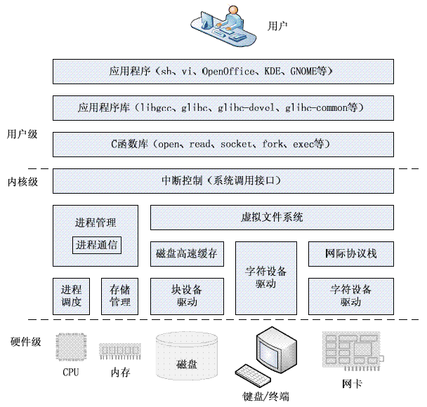
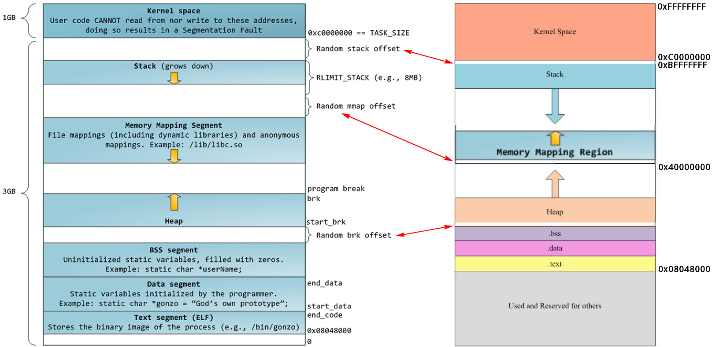

[TOC]


## 01 开篇介绍

开篇词就是总结了接下来要学习的东西。总的来说，这门课有以下亮点：

- 有深度（其中涉及到 Linux 内核源码解析）
- 有广度（从 Linux 基础，谈到内核，到虚拟化，到容器、集群、数据中心操作系统等）
- 有趣味（类比于一家公司，操作系统是这家公司的老板）
- 图文并茂

开篇放出了一张 Linux 操作系统全景图（深入到代码），如下：




这张图展示了进程、文件、文件系统、硬盘之间的一个关系（Linux的哲学之一就是一切皆文件），这里面涉及到内核代码结构，其实就是一个个的数据结构拼接起来，想象一下，操作系统那么多组件，怎么样很好地管理这些组件，就是把他们定义成一个个的数据结构，然后有关系的就连接起来。

## 03 学习路径

一图胜千言


## 04 认识 Linux

从电脑组装说起。一台电脑硬件上来说至少应该包括以下组件，才能满足我们个人的使用需求。



光有这些硬件设备也玩不转一台电脑，必须要有一个类似于大脑的东西来指挥这些硬件才行，这个大脑就是操作系统。

操作系统要管理不同的硬件设备，就需要有不同的模块组件，就像一个组织需要设定几个不同的负责人一样。从功能和管理对象上说，可以分为以下几大类（操作系统体系结构图）：



上面这幅图关注点在于内核态，对于完整的操作系统，还应该包括用户态，以及用户态和内核态的交互模块，下面这幅图包含了这一切，而且还包括了硬件部分，非常完整：



---

### 内核代码

**如何找 Linux 内核代码？**

Linux 内核源码链接：

https://www.kernel.org/

*在里面找到 `kernel/git/torvalds/linux.git` 即可下载*

推荐一个 **在线阅读源码** 的网站（非常赞）：

https://elixir.bootlin.com/linux/latest/source


**内核代码结构如何体现出上面的几大子系统的？**

以 Linux 3.0 为例看看它的代码结构：

| 目录          | 描述                                                         |
| ------------- | ------------------------------------------------------------ |
| arch          | 包含和硬件体系结构相关的代码，每种平台占一个相应的目录，如 i386、 ARM、PowerPC、MIPS 等。 |
| block         | 块设备驱动程序 I/O 模块。                                    |
| crypto        | 常用加密和散列算法（如 AES、SHA 等），还有一些压缩和 CRC 校 验算法。 |
| Documentation | 内核源码文档                                                 |
| drivers       | 设备驱动程序，每个不同的驱动占用一个子目录，如 char、block、net、 mtd、i2c 等。 |
| firmware      | 使用某些驱动程序而需要的设备固件                             |
| fs            | vfs 和 支持的各种文件系统，如 EXT、FAT、NTFS、JFFS2 等。     |
| include       | 内核 头文件，与系统相关的头文件被放置在 include/linux 子目录下 |
| init          | 内核引导和初始化代码                                         |
| ipc           | 进程间通信的代码                                             |
| kernel        | 内核的最核心部分，包括进程调度、定时器等，而和平台相关的一 部分代码放在 arch/*/kernel 目录下 |
| lib           | 库文件代码，通用内核函数                                     |
| mm            | 内存管理子系统代码，和平台相关的一部分代码放在 arch/*/mm 目录下 |
| net           | 网络子系统相关代码，实现了各种常见的网络协议                 |
| samples       | 示例，示范代码                                               |
| scripts       | 编译内核所用的脚本文件                                       |
| security      | Linux 安全模块， 主要包含 SELinux 模块。                     |
| sound         | 音频子系统， ALSA、OSS 音频设备的驱动核心代码和常用设备驱动。 |
| usr           | 早期用户空间代码（所谓的initramfs）， 实现了用于打包和压缩的 cpio 等 |
| tools         | 在 Linux 开发中有用的工具                                    |
| virt          | 虚拟化基础结构                                               |


## 05 快速上手 Linux 命令

### 用户名和密码

- 配置 root 密码：`passwd` 或 `passwd root` （`passwd <user>`）
- 创建一个新的用户：`useradd jay`
- 创建一个新的用户并加到某个组里：`useradd jay -g <gid>`
- `/etc/passwd` 和 `/etc/group` 中能够看到用户密码和用户组的信息

### 浏览文件

```sh
ls -l
drwxr-xr-x 6 root root    4096 Oct 20  2017 apt
-rw-r--r-- 1 root root     211 Oct 20  2017 hosts
```

- 第一个字段中的第一个字符 `-` 表示普通文件，`d` 表示目录文件，`l` 表示连接文件
- 接着后面 9 个字符表示模式（权限位），前面 3 个是所属用户的读写执行权限，中间 3 个是用户所属组的，后面 3 个是其他用户的。改变权限使用 `chmod 711 <file>` 
- 第二个字段是硬链接数目
- 第三个字段是所属用户
- 第四个字段是所属用户组
- 第五个字段是文件大小
- 第六个字段是文件被修改的日期
- 最后是文件名

`chmod` 改变文件权限，`chown` 改变所属用户，`chgrp` 改变所属组。

```sh
# 将文件 file.txt 的拥有者改为 root，这个命令需要有超级用户权限才能执行，所以我们在命令之前加上sudo
sudo chown root file.txt 
```

```sh
# 改变文件的拥有组为root组
sudo chgrp root file.txt

# 将文件的所属组由 root 改为 tim
chgrp -v tim file.txt
```


### 安装软件

相对于 Windows 的 `exe`、`zip` 等包，Linux 常用有 `rpm`（Centos 系）、`deb`（Ubuntu 系） 和 `tar.gz` 等包。

- `rpm` 和 `deb`

  

```sh
# centos rpm
rpm -i jdk-XXX_linux-x64_bin.rpm

# ubuntu deb
dpkg -i jdk-xxx_linux-x64_bin.deb

# 查看安装软件列表
rpm -qa
dpkg -l

# 翻页
rpm -qa | more
rpm -qa | less

# 加搜索
rpm -qa | grep jdk
dpkg -l | grep jdk

# 删除
rpm -e 
dpkg -r

```


- Linux 软件管家：`yum` 和 `apt-get`


```sh
# 搜索软件
yum search jdk
apt-cache search jdk

# 安装
yum install java-11-openjdk.x86_64
apt-get install openjdk-9-jdk
```


- 配置软件源：国内常用是 `阿里源` 和 `163源`。（用到时搜索即可）

centos：`/etc/yum.repos.d/CentOS-Base.repo`


ubuntu: `/etc/apt/sources.list`


- 包下载和压缩解压缩


```sh
# 下载
wget

# 压缩解压缩
yum install zip.x86_64 unzip.x86_64
apt-get install zip unzip

unzip <xx.zip>
tar zxvf jdk-XXX_linux-x64_bin.tar.gz
```


- 运行程序


```sh
# 01 直接运行
<command> 或者 <./command>

# 02 后台运行
nohup <command> >out.file 2>&1 &

# 后台进程关闭
ps -ef |grep 关键字  |awk '{print $2}'|xargs kill -9

# 03 以服务的方式运行 /lib/systemd/system
# 比如 mysql
apt-get install mysql-server # 安装
systemctl start mysql # 启动
systemctl enable mysql # 设置开机启动

# centos 中 MySQL 是 MariaDB。/usr/lib/systemd/system/
```


### 开关机

```sh
# 关机
shutdown -h now
poweroff

# 重启
reboot
```


### 一图总结之


## 05 系统调用

**进程相关系统调用：** 


- fork：创建子进程，返回两个值，如果是 0，表示子进程，如果 >0 表示父进程，值是子进程的 ID。
- execve：创建出的子进程执行的系统调用（有一套函数集）。
- waitpid：父进程监听子进程的执行情况。

通过如下方式查询更加详细的信息:

```sh
$ps -o pid,pgid,ppid,sid,tty,comm
```

(tty表示控制终端）


进程地址空间：




**进程内存空间分配系统调用：**


- brk：当分配内存量小的时候（具体是 128K）使用；
- mmap：当分配内存量大于 128K 时使用，这么做的目的是避免 **内存碎片** 的问题。参考[这里](<https://blog.csdn.net/yusiguyuan/article/details/39496057>)


**异常与信号处理相关系统调用：**


- kill：用户进程发送一个退出信号给另一个进程
- sigaction：信号处理函数（无视(ignore)信号、默认(default)操作、自定义操作）


`$man 7 signal` 查阅更多的信号。一些常用的信号：

- `SIGINT`   当键盘按下 `CTRL+C` 从 shell 中发出信号，信号被传递给shell中前台运行的进程，对应该信号的默认操作是中断 (INTERRUPT) 该进程。
- `SIGQUIT`  当键盘按下 `CTRL+\` 从 shell 中发出信号，信号被传递给shell中前台运行的进程，对应该信号的默认操作是退出 (QUIT) 该进程。
- `SIGTSTP`  当键盘按下 `CTRL+Z` 从 shell 中发出信号，信号被传递给shell中前台运行的进程，对应该信号的默认操作是暂停 (STOP) 该进程。
- `SIGCONT`  用于通知暂停的进程继续。
- `SIGALRM`  起到定时器的作用，通常是程序在一定的时间之后才生成该信号。


**进程间通信系统调用：**


- 消息队列：msgget（创建）、msgsnd（发送）、msgrcv（接收）
- 共享内存（通信量大）：shmget（创建）、shmat（映射共享内存）
- 信号量（资源访问竞争）：sem_wait（占用资源）、sem_post（释放资源）
- 管道（无名管道和命名管道）
- Socket
- 参考[这里](<https://songlee24.github.io/2015/04/21/linux-IPC/>)


**C 函数库（glibc）和系统调用的关系：**


C 函数库是对相关系统调用函数的进一步封装，目的是以一种更友好的方式供上层用户的调用。系统调用更像是组成一个汉字的 **笔画** ，而库函数则像 **偏旁部首** 。比如 glibc 中的 printf 函数就会调用 `sys_open`、`sys_mmap`、`sys_write`、`sys_close` 等系统调用函数。malloc 函数也会进一步调用到 `sys_brk` 等函数。


**Tips：**


`$man 2 syscalls` 可以查看所有的系统调用，`$man 2 read` 查看系统调用 read 的详细说明。


### 一图总结


## 06 x86 体系架构

硬件图结合计算机的逻辑图：


CPU 和 内存如何配合工作：

CPU 包括：

- 运算单元：如加减乘除
- 数据单元：CPU 内部的缓存和寄存器组
- 控制单元：指令获取、控制
  - 指令指针寄存器：执行下一条指令在内存中的地址
  - 指令寄存器


x86 CPU 组件放大图：


运算单元：

- 通用寄存器

控制单元：

- IP：指令指针寄存器
- CS： 代码寄存器
- DS：数据寄存器
- SS：栈寄存器


一图总结之：


## 07 Linux 启动过程

1 打开电源，从主板上的 BIOS 读取其中存储的程序，这个程序知道主板连接哪些硬件（硬盘、网络接口、键盘、串口、并口），BIOS 会检查以哪种方式启动（软盘、光盘、硬盘）。（BIOS 存储在 ROM 只读区）


2 读取启动盘中的前 512 个字节，也就是 MBR （主引导扇区）

3 MBR 会从设备的某一个分区来转载 **引导加载程序** （BootLoader） ，BootLoader 含有 OS 相关的信息，比如 OS 内核，OS 内核所在的位置等。常用的 BootLoader 程序有 **GRUB2** 和 **LILO** 。

可以通过 `grub2-mkconfig -o /boot/grub2/grub.cfg` 来配置系统启动的选项。

4 BootLoader 接着会加载内核程序

具体地，它会安装 `boot.img` 、`core.img` 等镜像程序。其中 `kernel.img` 就是存放的 OS 内核程序。一般会有多个程序（多操作系统），我们选择其中一个。


5 假如选择 Linux内核，内核会预留一部分自己的内存空间，然后通过驱动程序检测哪些计算机硬件可用，然后会启动一个 `init` 进程，它是 Linux 内核中的 1 号进程（Linux 没有 0 号进程），至此，便完成启动阶段做的事，接下来就交给 `init` 进程来管理。

6 `init` 进程会运行一系列的初始脚本（shell脚本）：

设置计算机名称，时区，检测文件系统，挂载硬盘，清空临时文件，设置网络……

至此，整个 OS 便准备好了，`init` 启动登录程序，输入用户名、密码便可自行玩耍了。


**附：**

grub2 命令的使用手册见：

<http://www.cnblogs.com/f-ck-need-u/p/7094693.html>


## 08 内核初始化

从源码上来讲，内核初始化从 函数 `start_kernel` 开始的，相当于内核的 `main` 函数，在文件 `init/main.c` 中。它总的要进行几件事：

- 任务初始化
- 中断初始化
- 内存管理初始化
- 调度器初始化
- 其他（如进程线程）初始化


`init_task` 产生 0 号进程，这是唯一一个没有通过 `fork` 或者其他 `kernel_thread` 产生的进程，是进程列表的第一个。


`rest_init` 会产生两个进程，一号进程和二号进程来对用户态和内核进行初始化。


CPU 的分层权限限制，导致用户态和内核态的访问需要采用系统调用的手段：


系统调用总的一个过程基本上是：


## 09 系统调用

用户态访问内核：

- 系统调用
- C 函数库 glibc（最终也是调用系统调用函数）


在 glibc 源代码中，有个文件 `syscallls.list`，里面列着所有 glibc 的函数对应的系统调用。

```C
# File name Caller  Syscall name    Args    Strong name Weak names
open		-	open		Ci:siv	__libc_open __open open
```


Glibc 还有一个文件 `syscall-tmplate.S` ，使用 宏，定义了系统调用的调用方式：

```C
T_PSEUDO (SYSCALL_SYMBOL, SYSCALL_NAME, SYSCALL_NARGS)
    ret
T_PSEUDO_END (SYSCALL_SYMBOL)

#define T_PSEUDO(SYMBOL, NAME, N)		PSEUDO (SYMBOL, NAME, N)
```


这里有一个 宏 `PSEUDO`，对于任何一个系统调用，都会调用到这个 宏：

```C
#define PSEUDO(name, syscall_name, args)                      \
  .text;                                      \
  ENTRY (name)                                    \
    DO_CALL (syscall_name, args);                         \
    cmpl $-4095, %eax;                               \
    jae SYSCALL_ERROR_LABEL
```


32 位系统调用过程和 64 位还有些许不同，我们直接看 64 位的：

接着，开始陷入内核，OS 会将系统调用名称转换为系统调用号，放到寄存器 rax 中，然后执行 `syscall`，然后通过一种特殊模块寄存器（MSR）来完成系统调用的功能，它会将系统调用相关的指令压入内核：


然后通过一个 **系统调用表** 找到相应的函数，进行执行。

系统调用表存放着所有的系统调用函数，对于 64位的系统，是定义在文件 `arch/x86/entry/syscalls/syscall_64.tbl` 中的（比如 `open` 是这样定义的）:

```
2	common	open			sys_open
```


通过寄存器 rax 中的系统调用号，就可以找到系统调用表中对应的系统调用函数，从而执行真正的内核函数，比如 `open` 对应内核函数为 `sys_open`。


## 10 进程

安装开发套件：(centos 7)

```sh
yum -y groupinstall "Development Tools"
```


程序文件具有 **严格的格式** ：ELF（Executeable and Linkable Format）

ELF 是一种用于二进制文件、可执行文件、目标代码、共享库和核心转储的标准文件格式。

目标文件有三类（可通过 file 命令查看）：

- 可重定位的目标文件（.o 文件）
- 可执行的目标文件（.exe 文件）
- 可被共享的目标文件（.so 动态库文件）


从文本文件到二进制可执行文件的过程：


1、.o 文件时 ELF 的第一种文件类型，格式如下：


将 .o 归档为 .a 的静态库文件，使用命令 ar：

```sh
ar cr libstaticprocess.a process.o
```

- .text：存放编译好的二进制可执行代码
- .rodata：只读数据，例如字符串常量、const 的变量
- .data：已经初始化好的全局变量
- .bss：未初始化的全局变量
- .symtab：符号表，记录的事函数和变量
- .strtab：字符串表、字符串常量和变量名


编译的时候使用静态链接库：

```sh
gcc -o staticcreateprocess createprocess.o -L. -lstaticprocess
```


2、生成的二进制可执行文件为 ELF 的第二种格式。


静态链接库如果更新，那个多个引用的程序都要随之更新，效率低，因为出现动态链接库，可被多个程序共享。


3、动态链接库是 ELF 的第三种格式。共享对象文件。

```sh
gcc -shared -fPIC -o libdynamicprocess.so process.o
```


```sh
gcc -o dynamiccreateprocess createprocess.o -L. -ldynamicprocess
```


> 当一个动态链接库被链接到一个程序文件中的时候，最后的程序文件并不包括动态链接库中的代码，而仅仅包括对动态链接库的引用，并且不保存动态链接库的全路径，仅仅保存动态链接库的名称。


系统默认加载的路径是 /lib 和 /usr/lib，可以使用 `LD_LIBRARY_PATH` 来自定义动态库链接的路径。

```sh
export LD_LIBRARY_PATH = .
```


进程调用 exec -> load_elf_binary，最终将动态库加载的内存。

exec 函数：

- 包含 p 的函数（execvp, execlp）会在 PATH 路径下面寻找程序； 
- 不包含 p 的函数需要输入程序的全路径； 
- 包含 v 的函数（execv, execvp,execve）以数组的形式接收参数； 
- 包含 l 的函数（execl, execlp, execle）以列表的形式接收参数； 包含 e 的函数（execve, execle）以数组的形式接收环境变量。


进程树：

所有进程都是由父进程 fork 过来的，往前追溯，会找到祖宗进程，也就是系统启动的 init 进程。


有些系统中，比如 centos ，/sbin/init 会被链接到 systemd。

一图总结之：


Tips:

查看 ELF 文件的工具：

- readelf：分析 ELF 文件的信息
- objdump：显示二进制文件信息
- hexdump：查看文件的 16进制编码
- nm：显示关于指定文件中符号的信息


## 11 线程

多线程程序的编译依赖于 `libpthread.so`

```sh
gcc thread.c -lpthread
```


普通线程的创建和运行过程：


多线程可访问的数据：

- 线程栈上的本地数据，比如函数执行过程中的局部变量。（`ulimit -a` 查看栈的大小）
- 整个进程里共享的全局数据，比如全局变量
- 线程的私有数据


线程共享数据的保护问题：

- Mutex（互斥变量）
- 条件变量（一般和互斥锁配合使用）


## 12 进程数据结构

在内核中，进程和线程都是由一个数据结构 `task_struct` 来统一管理。


每个进程或线程定义一个这个结构，多个进程用链表连接起来。

其中，

任务 ID：

- pid：进程 id
- tgid：多个线程中主线程对应的进程 ID
- group_leader：多线程中主线程


信号处理：

```c
/* Signal handlers: */
struct signal_struct		*signal;
struct sighand_struct		*sighand;
sigset_t			blocked;
sigset_t			real_blocked;
sigset_t			saved_sigmask;
struct sigpending		pending;
unsigned long			sas_ss_sp;
size_t				sas_ss_size;
unsigned int			sas_ss_flags;
```


包括，

- blocked：阻塞暂不处理
- pending：尚等待处理
- sighand：正在被信号处理函数处理


任务状态：

值定义在 `include/linux/sched.h` 中，

```c
/* Used in tsk->state: */
#define TASK_RUNNING                    0
#define TASK_INTERRUPTIBLE              1
#define TASK_UNINTERRUPTIBLE            2
#define __TASK_STOPPED                  4
#define __TASK_TRACED                   8
/* Used in tsk->exit_state: */
#define EXIT_DEAD                       16
#define EXIT_ZOMBIE                     32
#define EXIT_TRACE                      (EXIT_ZOMBIE | EXIT_DEAD)
/* Used in tsk->state again: */
#define TASK_DEAD                       64
#define TASK_WAKEKILL                   128
#define TASK_WAKING                     256
#define TASK_PARKED                     512
#define TASK_NOLOAD                     1024
#define TASK_NEW                        2048
#define TASK_STATE_MAX                  4096
```


所有定义的状态如下图所示：


其中，

- TASK_RUNNING：表示进程在时刻准备运行（并不是正在运行，当获得 CPU 时间片的时候进入运行）
- TASK_INTERRUPTIBLE：可中断的睡眠状态（浅睡眠），当信号来的时候，进程可被唤醒
- TASK_UNINTERRUPTIBLE：不可中断的睡眠状态（深睡眠），不可被信号唤醒，只能死等 I/O 操作完成，kill 也不行
- TASK_KILLABLE：可以终止的睡眠状态，上面的改良，可以响应致命信号
- TASK_WAKEKILL：在接收致命信号时唤醒进程
- TASK_STOPPED：进程收到 SIGSTOP、SIGINT、SIGTSTP 或者 SIGTTOU 后进入的状态
- TASK_TRACED：进程被 debugger 等进程监视，进程执行被调试程序所停止
- EXIT_ZOMBIE：进程结束首先进入的状态，如果父进程没有调用 waitpid() 函数的话，就成为 僵尸进程
- EXIT_DEAD 进程的最终状态